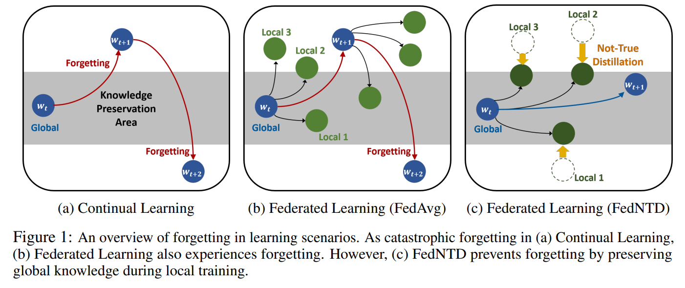

# FedNTD (Federated Not-True Distillation)

This repository is the official PyTorch implementation of:

[**"Preservation of Global Knowledge by Not-True Distillation in Federated Learning (NeurIPS 2022)"**](https://arxiv.org/abs/2106.03097).



Our code structure is based on [FedML](https://doc.fedml.ai/) but refactored for simplicity.

We implemented various FL algorithms in our framework: 
- **FedCurv**, **FedAvgM**, **Scaffold**, **Fedprox**, **MOON**, **FedNova**, **FedDyn**, and **FedNTD (Ours)**.

## Requirements

- This codebase is written for `python3` (used `python 3.8.8` while implementing).
- We use Pytorch version of `1.9.0` and `10.2`, `11.0` CUDA version.
- To install necessary python packages,  
    ```
    pip install -r requirements.txt
    ```
- The logs are uploaded to the wandb server. If you do not have a wandb account, just install and use as offline mode. 
  ```
  pip install wandb
  wandb off
  ```

## How to Run Codes?

The configuration skeleton for each algorithm is in `./config/*.json`. 
- `python ./main.py --config_path ./config/algorithm_name.json` conducts the experiment with the default setups.

There are two ways to change the configurations:
1. Change (or Write a new one) the configuration file in `./config` directory with the above command.
2. Use parser arguments to overload the configuration file.
- `--dataset_name`: name of the datasets (e.g., `mnist`, `cifar10`, `cifar100` or `cinic10`).
  - for cinic-10 datasets, the data should be downloaded first using `./data/cinic10/download.sh`.
- `--n_clients`: the number of total clients (default: 100).
- `--batch_size`: the size of batch to be used for local training. (default: 50)
- `--partition_method`: non-IID partition strategy (e.g. `sharding`, `lda`).
- `--partition_s`: shard per user (only for `sharding`).
- `--partition_alpha`: concentration parameter alpha for latent Dirichlet Allocation (only for `lda`).
- `--model_name`: model architecture to be used (e.g., `fedavg_mnist`, `fedavg_cifar`, or `mobile`).
- `--n_rounds`: the number of total communication rounds. (default: `200`)
- `--sample_ratio`: fraction of clients to be ramdonly sampled at each round (default: `0.1`)
- `--local_epochs`: the number of local epochs (default: `5`).
- `--lr`: the initial learning rate for local training (default: `0.01`)
- `--momentum`: the momentum for SGD (default: `0.9`).
- `--wd`: weight decay for optimization (default: `1e-5`)
- `--algo_name`: algorithm name of the experiment (e.g., `fedavg`, `fedntd`)
- `--seed`: random seed


## Reference Github

We refer to the following repositories:
- https://github.com/FedML-AI/FedML (For overall code structure)
- https://github.com/JYWa/FedNova
- https://github.com/QinbinLi/MOON
- https://github.com/BayesWatch/cinic-10


## Citing this work

```
@article{lee2021preservation,
  title={Preservation of the global knowledge by not-true self knowledge distillation in federated learning},
  author={Lee, Gihun and Shin, Yongjin and Jeong, Minchan and Yun, Se-Young},
  journal={arXiv preprint arXiv:2106.03097},
  year={2021}
}
```
